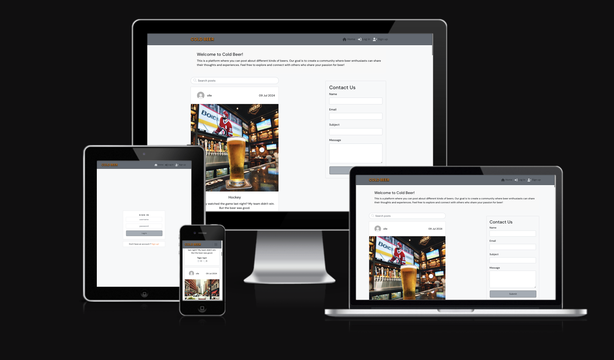
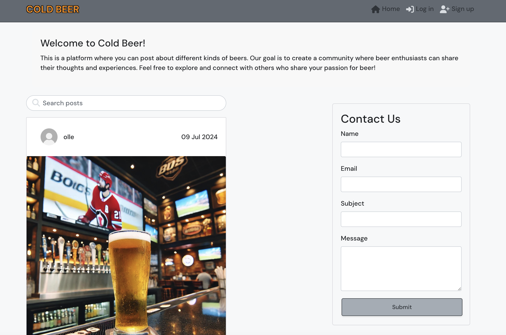
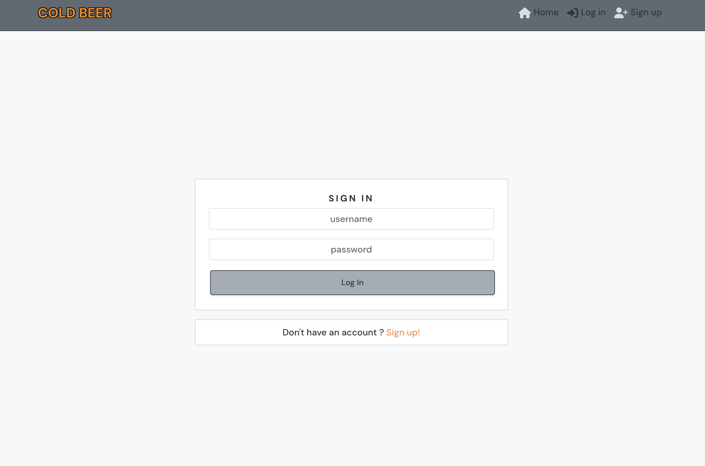
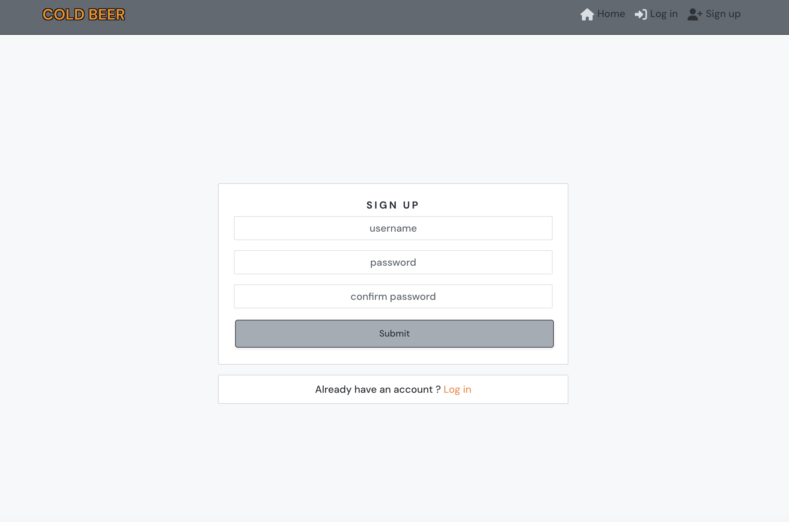
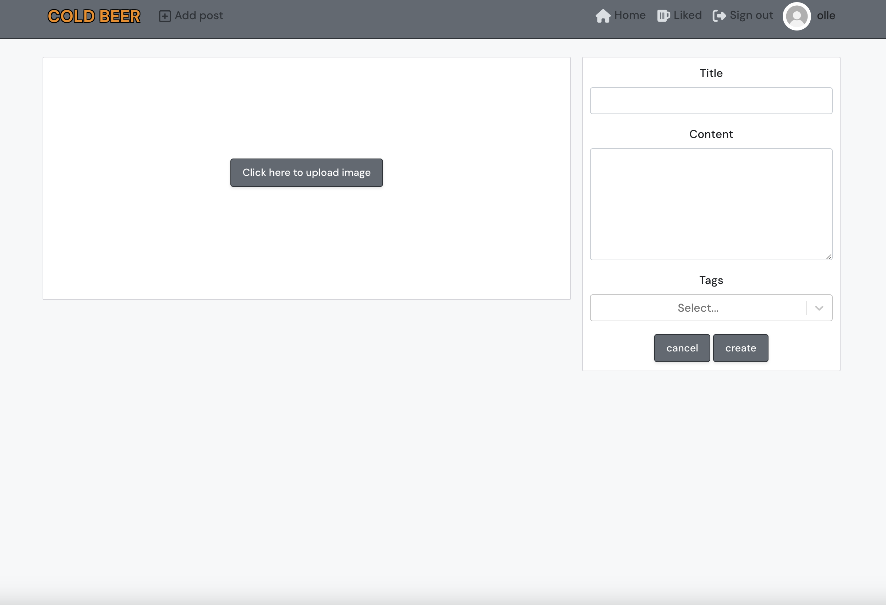
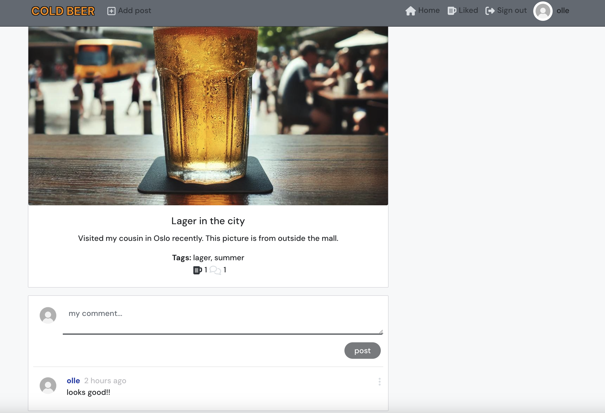
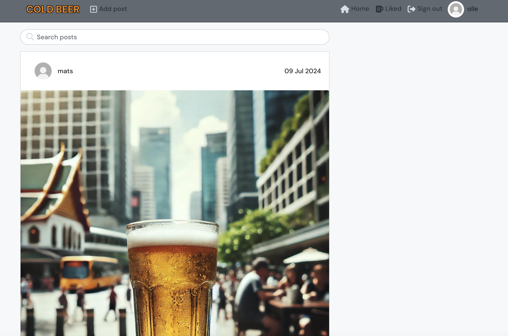
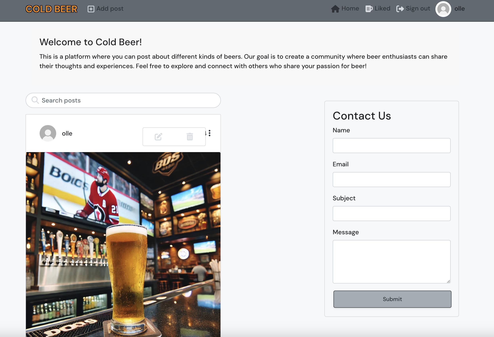
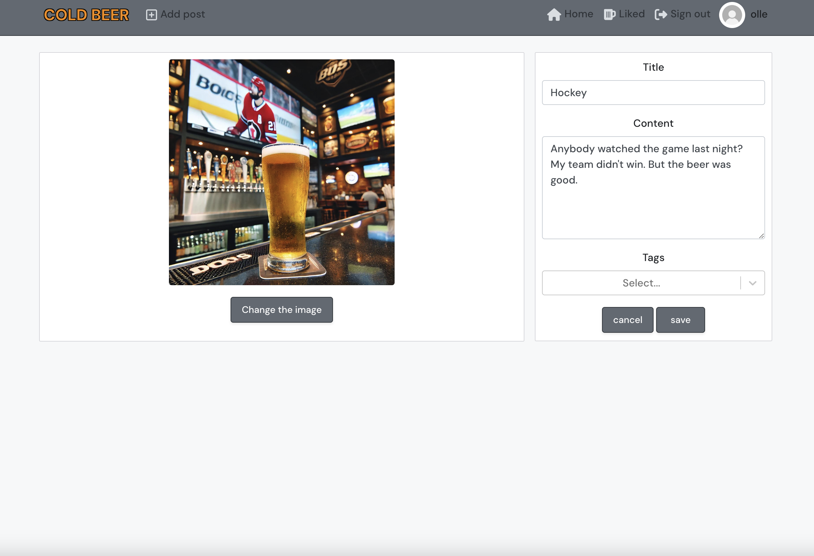
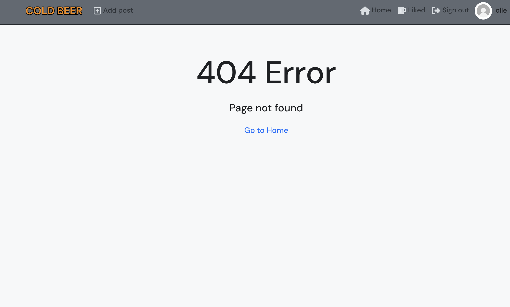

# Cold Beer



Cold Beer is my final project for Code Institute, serving as a vibrant platform designed for beer enthusiasts to explore and share their favorite brews. This site enables users to effortlessly browse posts about different beer varieties, breweries, and tasting experiences. The inclusion of user accounts allows individuals to create personalized posts, engage with the community through likes and comments, and track their favorite posts for future reference. A user-friendly contact form facilitates seamless communication with the site administrators.

Deployed API Heroku: [API link](https://pp5-olle-4b42abf5cfb4.herokuapp.com/)

Deployed Frontend Heroku: [Cold Beer](https://coldbeer-e9a4ef1fda7f.herokuapp.com/)

Backend Github [Repository](https://github.com/ollebrask/pp5-api)

Frontend Github [Repository](https://github.com/ollebrask/coldbeer)

## User Stories

I have created user stories with Github Issues and this is the [KANBAN board](https://github.com/users/ollebrask/projects/5/).

---

## User Experience (UX)

### Site Purpose

The primary purpose of Cold Beer is to provide a dynamic and engaging online platform for beer enthusiasts to explore, share, and interact with content related to beer. Whether users are looking for reviews, brewing tips, or the latest news in the beer world, the site aims to create a community where beer lovers can connect and engage.

### Site Goal

Cold Beer strives to become the go-to destination for beer enthusiasts by offering a user-friendly and comprehensive platform. The goal is to establish a reliable and engaging community that meets the diverse needs of its users, from casual beer drinkers to homebrewing professionals.

### Audience

The target audience for Cold Beer includes individuals passionate about beer, including casual drinkers, homebrewers, and industry professionals. The site is for users who enjoy discovering new beers, sharing reviews, and participating in discussions about brewing techniques and industry trends.

### Communication

The site communicates beer-related content, features, and functionalities clearly and concisely to users. Through an intuitive interface, Cold Beer aims to convey information effectively, ensuring a positive and informative user experience.

### Current User Goals

Existing users on Cold Beer aspire to explore and find content that aligns with their interests. They seek to share images or reviews, and engage with other users through comments and likes. Clear communication channels, such as the contact form, facilitate inquiries and engagement.

### New User Goals

New users are expected to explore the site with ease, understanding its features and functionalities. Their primary goals include discovering beer-related content and understanding how to interact with the community.

### Future Goals

Cold Beer's future goals include expanding its user base by potentially allowing breweries and beer retailers to register and contribute content. The site aims to enhance its functionality to accommodate a broader range of beer-related interests and evolving market demands. Continued improvements in user experience and feature development are key aspects of the platform's ongoing evolution.

### Colors

The main colors are:

Light Gray (#f8f9fa): Used for background and to create a clean, open feel.

Darker Gray (#6c757d): Used as background color of the Navigation bar.

Orange (#f6950e): For the logo to make it pop out of the gray.


### Typography

 For its modern and approachable appearance, I have chosen [DM Sans](https://fonts.google.com/specimen/DM+Sans). This font is highly readable and web-friendly, making it ideal for both headings and body text.
---

## Features
  

Homepage: with post feed, info text and contact form.

  
  

 Login page:

  

 Signup page:

  

 Add post page:

  

 Post detail page: with comments section

  

 Liked page: all the posts that the logged in user has liked.

  

 Edit/Delete: for owner of the post

  

 Edit post:

  

 Page not found: When typing in a route that doesn't exist

  

---
## Reusable Components

- **Avatar.js**: Displays the user's avatar image and username throughout the site.
- **ContactUs.js**: A form component that allows users to send messages to the site administrators.
- **CurrentUserContext.js**: Provides the logged-in status and information of the current user to determine what functionality is available to that user.
- **axiosDefaults.js**: Configures default settings for axios to ease communication with the backend API.
- **MoreDropdown.js**: Provides a dropdown menu with edit and delete options, used in various components for additional actions.
- **NavBar.js**: The main navigation bar component that is displayed across all pages.
- **Asset.js**: Supplies the loading spinner and default images (such as user avatars) throughout the site.
- **useClickOutsideToggle.js**: A custom hook to handle the opening and closing of dropdown menus when clicking outside of them.
- **utils.js**: Provides utility functions used across multiple components, including token handling and other helper functions.
- **PostsPage.js**: Displays a list of posts, includes search functionality, and infinite scroll to load more posts.
- **Post.js**: Represents a single post, displaying all related information such as the title, content, tags, and interactive elements like like and comment buttons.
- **PostCreateForm.js**: A form component used for creating new posts.
- **PostEditForm.js**: A form component used for editing existing posts.

---

## Future Improvements

Due to lack of time against the deadline, these are the future implementation that needs to be done:

* Add feature to view and edit user profile and picture.
* Add feature to follow other profiles.
* Add feature to be able to sort posts by tags.
* Validate JavaScript code with ESLint.
* When image is loading for Post detail, show spinning asset instead.
* Right now, the contact us forms posted can only be accessed in the backend when superuser is logged in. Make viewable in frontend.
* Add feature to comment another comment.

---
## Wireframe

The design of the website was based on this wireframe:


---
## Technologies Used

- ### Languages:
    
    + [JavaScript](https://www.javascript.com/): Primary language for developing the React frontend site.
    + [Python](https://www.python.org)
    + [HTML](https://developer.mozilla.org/en-US/docs/Web/HTML)
    + [CSS](https://developer.mozilla.org/en-US/docs/Web/css)

- ### Frameworks and libraries:

    + [React](https://legacy.reactjs.org/docs/getting-started.html) Javascript library for building the component based UI and avoiding having to refresh to display dynamic content
    + [React Bootstrap](https://react-bootstrap-v4.netlify.app/) CSS framework for styled components
    + [Axios](https://axios-http.com/) Promise based http client for making http requests to the backend API
    + [React Infinite Scroll](https://www.npmjs.com/package/react-infinite-scroll-component) Used to easily load extra content rather than paginating pages, for a better UX
    + [React Router](https://v5.reactrouter.com/web/guides/quick-start) Used to dynamically load pages and aid site navigation for the user.
    + [jwt-decode](https://www.npmjs.com/package/jwt-decode) A browser library that helps decoding JWT's token
    + [Cloudinary](https://cloudinary.com/) - To host images
    + [React-select](https://react-select.com/) For searching and adding multiple tags to posts.

- ### Other tools:

    + [Git](https://git-scm.com/): the version control system used to manage the code.
    + [Heroku](https://dashboard.heroku.com/): the cloud platform used to host the website.
    + [GitHub](https://github.com/): used to host the website's source code.
    + [GitPod](https://gitpod.io/): the IDE used to develop the website.
    + [Chrome DevTools](https://developer.chrome.com/docs/devtools/open/): was used to debug the website.
    + [Font Awesome](https://fontawesome.com/): was used to create the icons used in the website.
    + [Favicon](https://favicon.io/) was used for the favicon.
    + [W3C CSS validator](https://jigsaw.w3.org/css-validator/): was used to validate CSS code for the website.
    + [JShint](https://jshint.com/) was used to validate the JS code.
    + [Balsamiq](https://balsamiq.com/) - Used to create wireframe.
    + [ChatGPT](https://chatgpt.com) - To create images for posts.

---
## Testing

Please refer to the [TESTING.md](TESTING.md) file for all test related documentation.

---

## Deployment

The site has been deployed using Heroku. 
For instructions of deploying the backend: go to [Backend README](https://github.com/ollebrask/pp5-api/blob/main/README.md)

1. Open repository in Gitpod
2. Run the command ```npx create-react-app . --use-npm```
3. After it has finished run the command ```npm start``` to check if the app is working.
4. Git add, commit and push.

### Heroku

1.  Login to your account at [Heroku](https://dashboard.heroku.com)

2.	Click "New" to create a new app.

3.	Select a unique name, selected the region, and click Create app.


### Connect to the API

Navigate to the Heroku app of the projects backend app, and under the Settings tab, add the following configvars:

- `CLIENT_ORIGIN` = <https://your-react-app-name.herokuapp.com>
- `CLIENT_ORIGIN_DEV` = <https://gitpod-browser-link.ws-eu54.gitpod.io>

### Deploy frontend

Navigate back to your frontend app in Heroku.

1. Go to the deploy tab.
2. Choose the deployment method.
3. Select Github, and confirm to connect to Github.
4. Search for the Github repository name.
5. Then click "connect".
6. Scroll down and click "Deploy Branch".

---

## Credits

- [Code Institute's](https://codeinstitute.net/) Moments Walkthrough project. Borrowed a lot of code from it.
- [Heroku](https://www.heroku.com/) for hosting the site.
- For tips and help: [Stackoverflow](https://stackoverflow.com)
- Github were used to store my repository: [GitHub](https://github.com)
- Bootstrap Documents [Bootstrap Docs](https://getbootstrap.com/docs)
- For searching and adding multiple tags to post [React-select](https://react-select.com/)
- [React docs](https://legacy.reactjs.org/docs/getting-started.html)
- Slack community for having a lot of solutions to problems.

---
## Acknowledgements

My mentor for valuable feedback! [Iuliia Konovalova](https://github.com/IuliiaKonovalova)